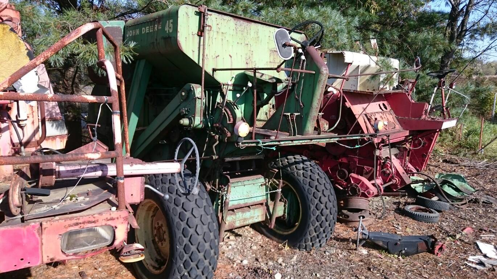

# 日本のJohn Deere

日本におけるJohn Deere社の歴史．資料と見聞のメモ書き.

# プラウ
## 北海道大学博物館のプラウ(1869-?, 北海道)

『北海道農業機械発達史』によると，北海道の農業機械化は，1869年にガルトネル氏が七重村に1000 ha の土地を箱館奉行から租借して大型機械価農場の開設が始まりだとされており，メーカーは不明だが，数多くの農具が輸入されたという記録がある．

1874-1876年にも札幌本庁や根室本庁にも，数多くの農具が輸入されている．

また，1882年の北大の史料でも数多くの農機具が輸入されたという記録がある．

北海道大学博物館ではDeere 社のプラウが展示されているため，日本におけるジョンディア社製品の輸入は，1869年から1882年の間に輸入された畜力牽きのプラウであることが伺える．

正確な年代は不明である．

## 小西農機とプラウ(1884, 北海道伊達市)

2026年現在，日本のプラウメーカーといえば，「白いプラウ」のスガノ農機であるが，いっときは，「伊達の赤プラウ」の小西農機が北海道伊達市で馬耕用プラウから開墾用プラウまで，数多くのプラウを製造していた．

その小西の赤プラウの始まりについて，スター農機の社史に記述がある．
曰く，
'''
明治17年(1884)伊達製糖会社委嘱のドイツ人技師セイドラーの始動の下，伊達在住の鹿児島県人鉄砲鍛冶，江田盛蔵が炭素焼きによるプラウ製造を始める．

製糖所がたまたまアメリカのジョン・デアー社のプラウ・カルチベータを輸入しており，その性能・耐用年数が優れていることから，国産化すれば安価なプラウの普及が図れると考え，セイドラー技師の指導を受け，ジョン・デアーの構造・材質の研究にあたり，刀剣製作の経験を活かしついに国産プラウを完成させた．
'''

伊達の製糖所がジョンディアのプラウを輸入していたようで，北海道開拓では既にジョンディア社の製品が輸入されていたことがわかる．


# トラクタ
## キープ協会のModel B styled(1951, 山梨県北杜市)

キープ牧場とDeere の関わりは歴史が長く，ポールラッシュ博士が1951年にModel B を輸入し，清里開拓を行ったようだ[(清里高原HP)](https://kiyosato.gr.jp/histry-2/).

現在，Model-Bがポール・ラッシュ記念館に展示されている
[キープ協会　第１号　トラクター](https://www.museum-kai.net/museum_home/19/item,73)

1960年代になって農機具として使命を終え，米国のジョンディア社によって半世紀前の姿に復元された，ようだ．

Model B は1935-1952年の間に306000台近く生産されたとのデータがあるため，Model Bの中でも後期モデルであり，styped なフロントグリルと，WWⅡの間に逼迫したゴムタイヤも装着している．

このトラクターが日本での最初期のジョンディアトラクターだと思われる．

現在，清泉寮付近には古いジョンディアトラクタが多数並べられているが，これは後の時代になってアメリカから輸入したトラクタであろう．
Model D, Model MC, Model A, B 430 である．

## 八ヶ岳のModel MC(1952?, 山梨県北杜市)
現在は萌木の村で屋外展示されている個体．

おそらく，Model Bと同時期に，アメリカから輸入された機械である．
Linderman のトラックトラクタで，非常に珍しい．

『石川島芝浦機械四十年史』には，K-20型トラクタクローラトラクタの試作・販売について記述があり，曰く
'''
(昭和)32年，当社は農業用小型クローラトラクタK-20型の設計開発に着手した．

その当時，八ヶ岳山麓で米国・ジョンディア社製の小型クローラが使用されていたので，これを松本工場に見本として借り，各部の構造や機能の研究調査を行った．

こうした苦心の末，試作されたK-20型クローラトラクタは32年末に2台完成した．
'''

昭和32年は1957年で，この数年のうちに，Model MCが輸入されたと考えてよいだろう．

ちなみに，Model MCは1946年に発表され，1952年まで製造されたようだから，1952-53年に輸入されたものと推測する．

このような，八ヶ岳でのジョンディアトラクタの輸入はキープ協会を通したものだったのか，修理はどのようにしていたのか，どのようなものであったか非常に気になるが手元に史料がない．

## 三国商工のジョンディアランツ(1962年，北海道札幌市)
昭和37年，1962年の価格表やカタログでは，「ジョンディア・ランツ」のM300, 500トラクタの情報が出てくる．

Deere 社は1956年11月12日に，ドイツのLanz 社の買収を決定した．
1957年-1959年にLanz 社から出荷されるトラクタは1シリンダーのD3606などのLanzブルーであったものが，deere カラーになっており，ラベルも，John Deere - Lanz となっている．

そうして，1960年，300, 500シリーズと行った，モダンなトラクタを出荷し始めた．

それが日本で，もともと，Lanz 社のトラクタの輸入を行っていた，三国商工株式会社が，輸入を開始したのだと思われる．

ジョンディア-ランッ の日本総代理店，とカタログの表紙には書かれている．
300や500を持ってきたあと，1010などのアメリカトラクタや，マンハイムの1020等を持ってくる．

## 日立建機の1010, 2010(1964, 茨城県土浦市)

『日立建機10年史』曰く

```
また，39年には，米国ディア社(Deere & Co.)と技術提携して，小型トラクタ1010, 2010を「日立ージョンディア」の名称で輸入販売を開始した．41年からは，それぞれJD350, JD450とし，また0.7㎥, 45PSのローダも加えた．

さらに43年からは好評のバックホウ付きJD350CLの国産化を開始した．
```

39年とは，昭和39年であり，つまり，1964年である．

三国が1960年からジョンディアランツを持ってきたと思ったら，今度は日立が1964年からアメリカの1010などを持ってきた．

この時代は，混沌とした時代だったのだろう．

## ヤンマーとジョンディア(1972, 滋賀県?大阪府?)

その後，1972年からヤンマーが販売を引き継ぎ，1020Aなどのカタログを出版していた．
ここから，現在に至るまで，ヤンマーがジョンディア社製のトラクタを取り扱うようになったのであろう．

# コンバイン
# Deere 45(1962, 北海道)

実は，1962年の三国商工の価格表にDeere 社の40-55までのコンバインの価格も提示されていた．
Deere社のself-propelled コンバインの製造は1944年くらいからであったことを考えると，Deere 社のコンバイン製造も安定して行っていたことが伺える．

おそらく，日本に初めて入ってきた、ジョンディアの自走式コンバインは45で，十勝に入ったものと思われる．
1968年発行『畑作の機械化技術, 第1回研究発表会報告資料』では，昭和41年度(1966年)に，ジョンデア45コンバイン(コーンアタッチメント付)でとうもろこしのコンバイン収穫を行った試験成績が書かれていたり，写真が掲載されていたりする．

明言されていないが，昭和37年から42年にかけての体系2の試験だったり，昭和38年から41年の体系1の試験だったりは，供試機械として，コンバインは刈り幅360 cm タンクタイプ1台だけがリストアップされていることから，S37年から45コンバインが使用されたと考えて差し支えないはずだ．

つまり，十勝の試験場で，S37年, 1962年にはDeere 45が動いていたことになる．

2018年などは，御影の某所で目撃できたが，2024年11月に訪れたときにはなくなってしまっていた。

在りし日の姿．


ダイヤモンドパターンタイヤ萌え．

# 他の機械
## マニュアスプレッダーはタカキタ製? 

もともとはカナダの会社で作っていたが、それがなくなったので日本のタカキタに図面を渡して作ってもらっていたらしい。
情報のソースがほとんどない。
