# CATERPILLAR AG6 (1988)

## 詳細情報
- **Serial Number:** Z5X01324
- **Hours:** 8,437
- **Price:** USD $18,500
- **Source URL:** <https://www.machinerytrader.com/listing/for-sale/229725299/1988-caterpillar-ag6-175-hp-to-299-hp-tractors>

## Description
285 Hp Turbo Engine, 50% Track Assemblies, Left Final Leaks, Runs Excellent, As Is

## Photos
<table>
  <tbody>
    <tr>
      <td style="padding:6px; vertical-align:top; text-align:center;">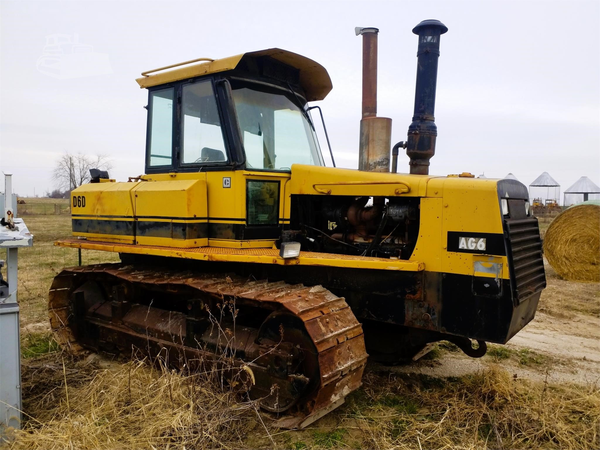
        
AG6_Z5X01324_1.png
</td>
      <td style="padding:6px; vertical-align:top; text-align:center;">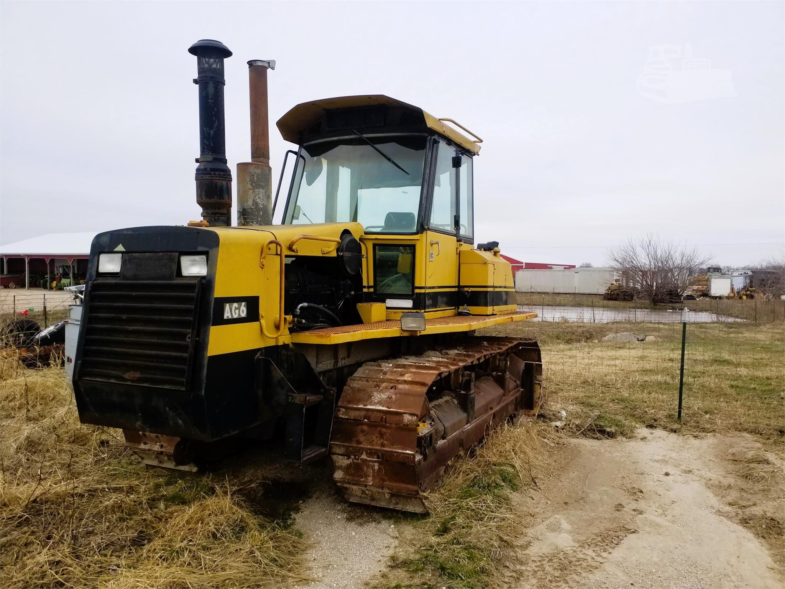
        
AG6_Z5X01324_2.png
</td>
      <td style="padding:6px; vertical-align:top; text-align:center;">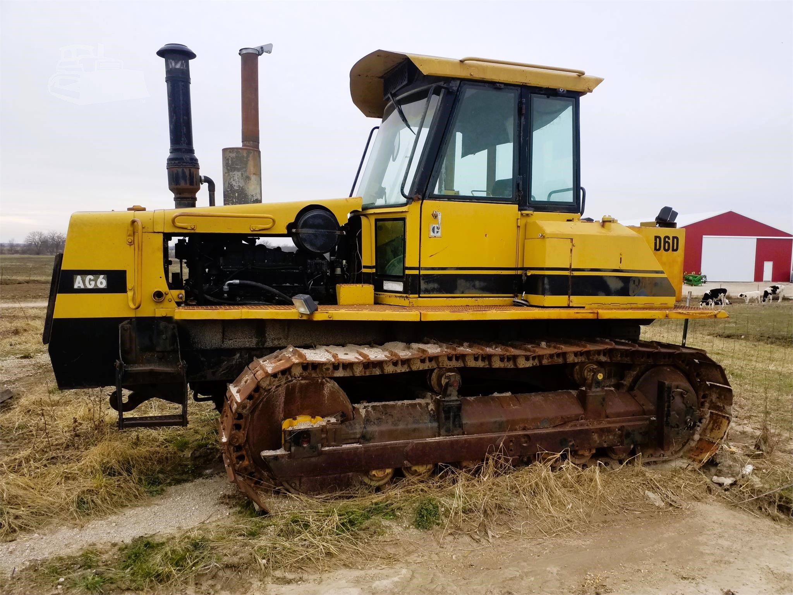
        
AG6_Z5X01324_3.png
</td>
    </tr>
    <tr>
      <td style="padding:6px; vertical-align:top; text-align:center;">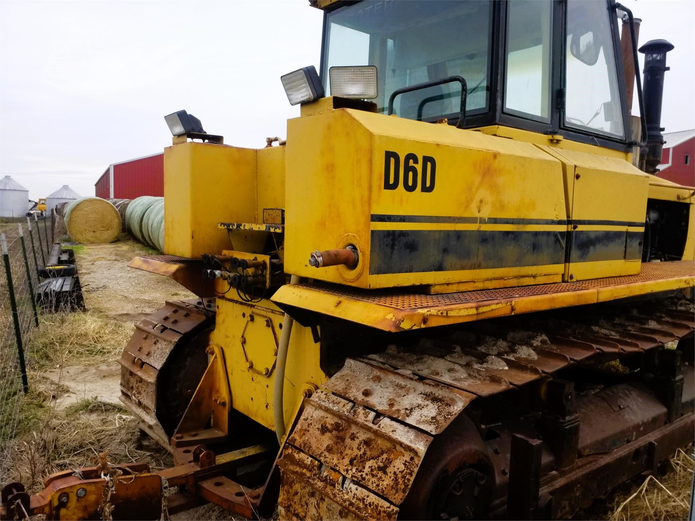
        
AG6_Z5X01324_4.png
</td>
      <td style="padding:6px; vertical-align:top; text-align:center;">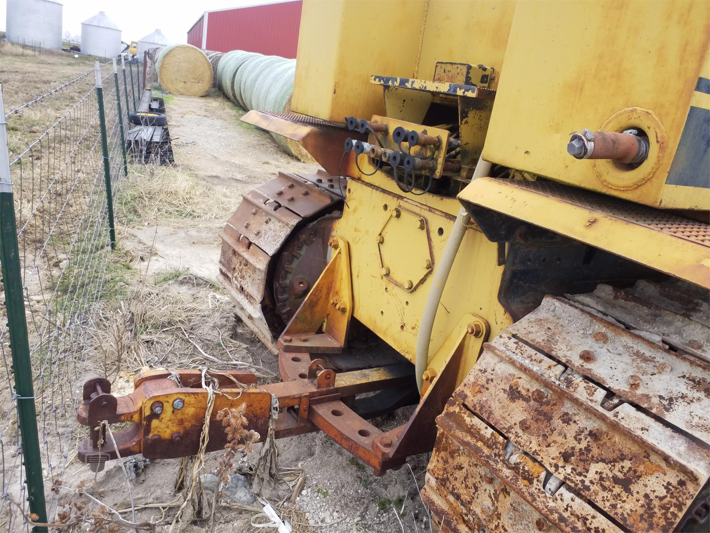
        
AG6_Z5X01324_5.png
</td>
      <td style="padding:6px; vertical-align:top; text-align:center;">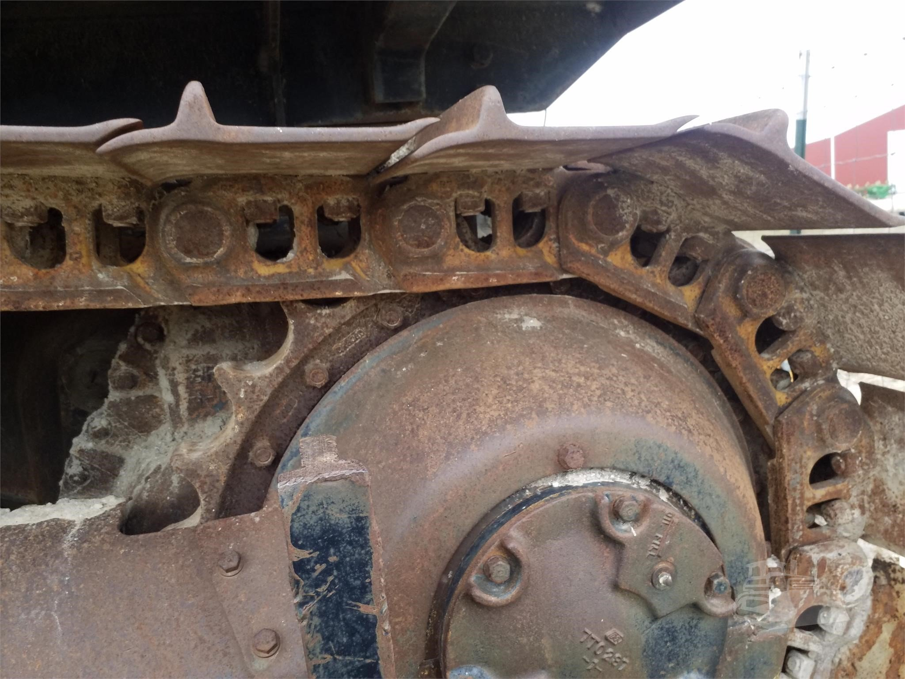
        
AG6_Z5X01324_6.png
</td>
    </tr>
    <tr>
      <td style="padding:6px; vertical-align:top; text-align:center;">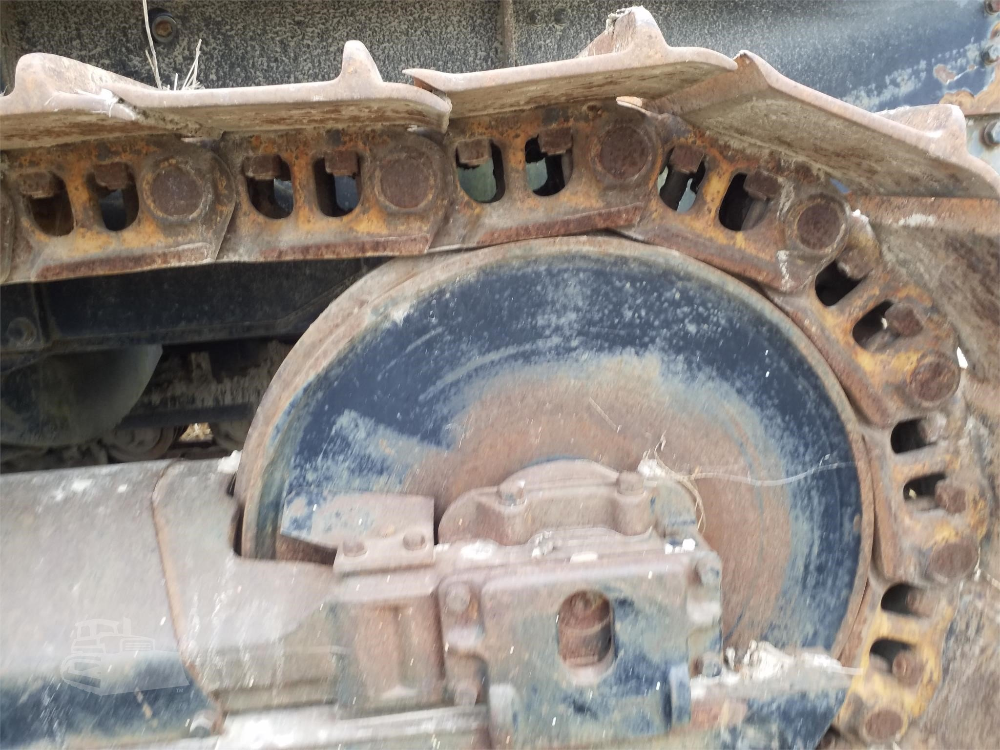
        
AG6_Z5X01324_7.png
</td>
      <td style="padding:6px; vertical-align:top; text-align:center;">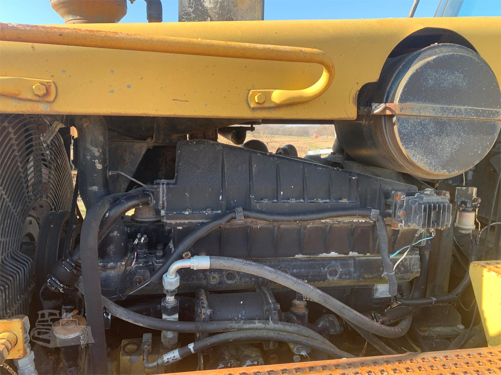
        
AG6_Z5X01324_8.png
</td>
      <td style="padding:6px; vertical-align:top; text-align:center;">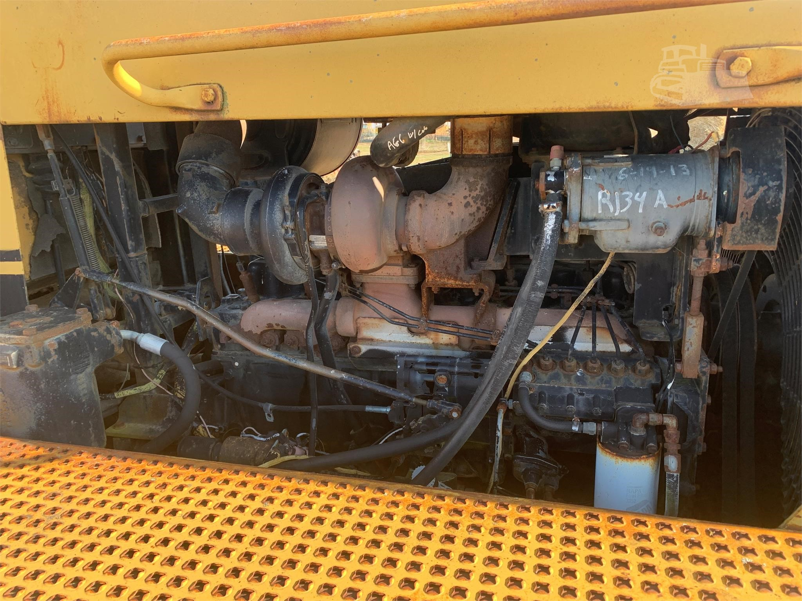
        
AG6_Z5X01324_9.png
</td>
    </tr>
    <tr>
      <td style="padding:6px; vertical-align:top; text-align:center;">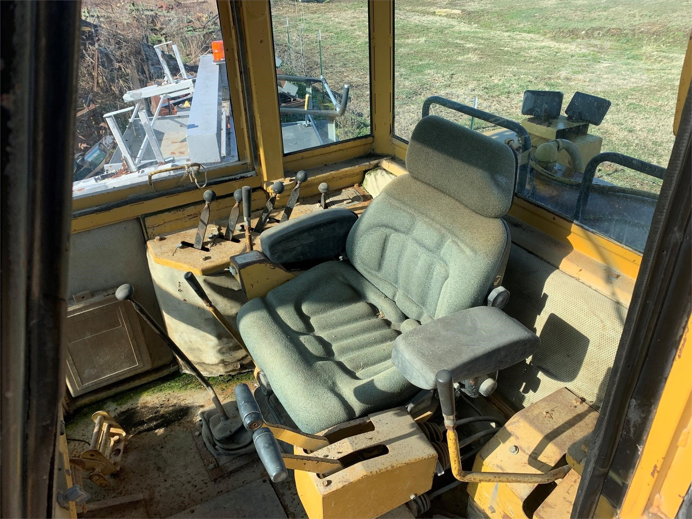
        
AG6_Z5X01324_10.png
</td>
      <td style="padding:6px; vertical-align:top; text-align:center;">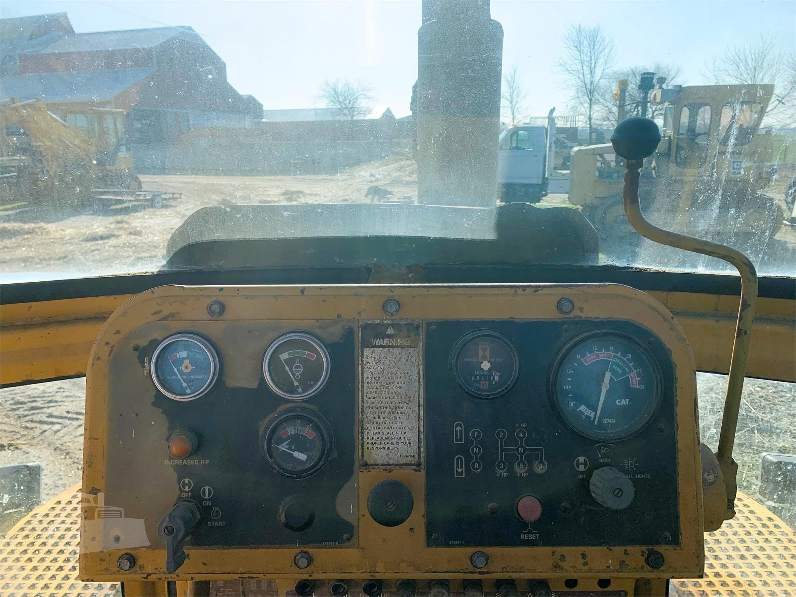
        
AG6_Z5X01324_11.png
</td>
      <td style="padding:6px; vertical-align:top; text-align:center;">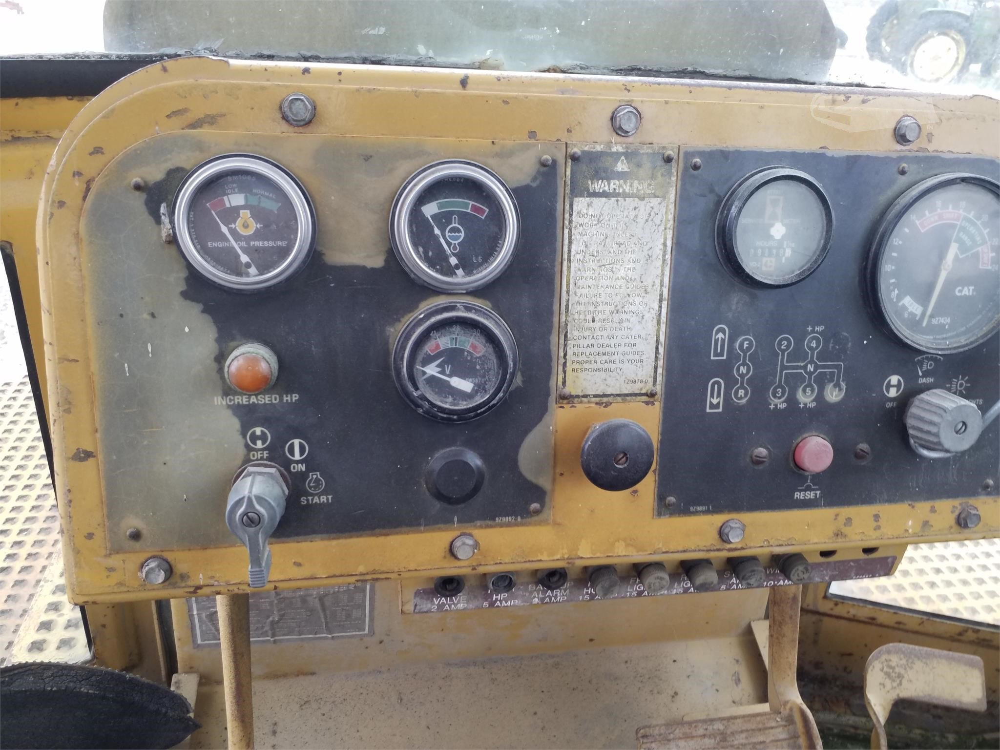
        
AG6_Z5X01324_12.png
</td>
    </tr>
  </tbody>
</table>
