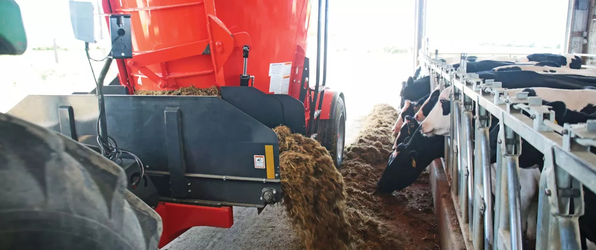
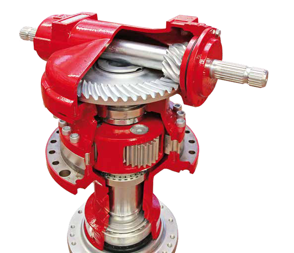
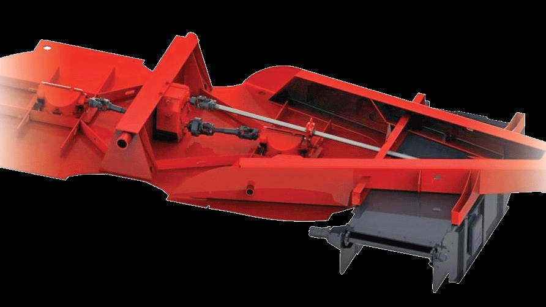
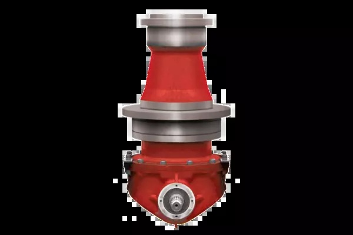
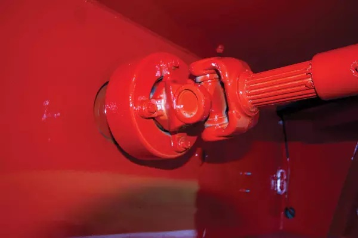
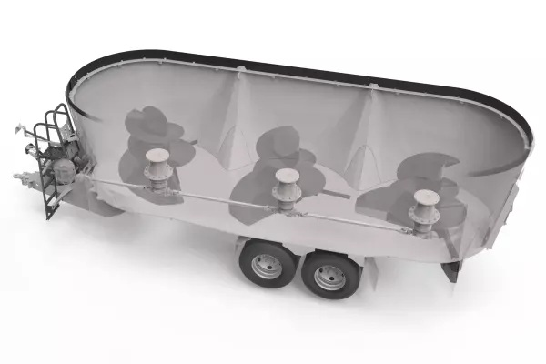
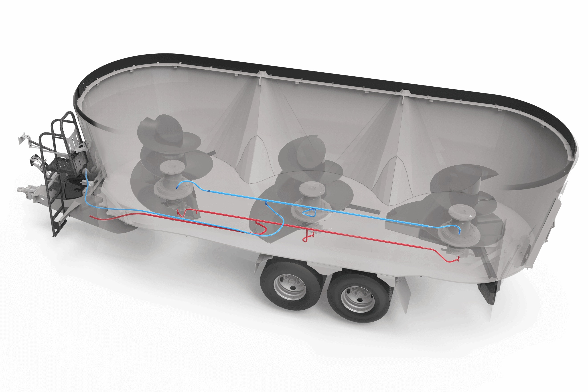

# 大型給餌ミキサーのギアボックス：構造と耐久性

調査日：2026年10月5日。対象は主にSILOKINGとKUHN Knightの縦型スクリュー式TMRミキサー。以下では、メーカーが明記する仕様と、その仕様から説明できる一般的な機械原理を区別する。

大型給餌ミキサーは、**低速・高トルクの減速機、遊星歯車による負荷分散、強固な軸とケース、過負荷保護、潤滑・冷却**を組み合わせ、重い飼料と繰り返し運転に対応している。両社の歯車の具体的な鋼種・熱処理条件までは、今回確認した公開資料では分からない。



*図1：KUHN Knight VTシリーズの給餌作業。出典：KUHN公式製品ページ［2］。*

## 1. 重さだけでなく、切断・絡み付き・始動が負荷になる

機械的に整理すると、ギアボックス周辺の負荷には次の種類がある。特定の機種で実測された負荷値ではなく、設計を理解するための整理である。

| 作業・現象 | 主な負荷 | 主に受け持つ部分 |
|---|---|---|
| 飼料の持ち上げ・循環 | 持続的な回転抵抗 | 歯車、軸、軸の接続部 |
| ロールの解体、ナイフの切断、繊維の絡み付き | 変動トルク、瞬間的なピーク | 歯車、軸、過負荷保護機構 |
| 満載状態からの始動 | 静止状態から動かす抵抗、加速トルク | 駆動系全体 |
| スクリューへの偏った力、投入時の衝撃 | 横荷重、軸方向荷重、曲げ、衝撃 | 軸受、軸、ケース、槽底・取付部 |
| 毎日の多バッチ運転 | 繰り返し疲労、油温上昇 | 歯面、軸受、潤滑・冷却系 |

サイレージやビートが重いことに加え、長い繊維が絡んだり、塊にナイフが食い込んだりして回転が妨げられることも重要である。投入物の全重量が、そのまま歯車にかかる荷重になるわけではない。

## 2. SILOKING：4個の遊星歯車を持つ専用減速機



*図2：SILOKING公式「TrailedLine 4.0」カタログの印刷ページ9から、減速機の断面画像を抽出。上部のかさ歯車、下部の遊星機構、軸の支持部を確認できる。出典：［1］。*

公式カタログには、専用の**4個の遊星歯車を持つ減速機**、**最大トルク52,000 N·m**、**100%油潤滑**、透明な外部オイルタンクが示されている［1］。

遊星減速機は、中心の太陽歯車、その周囲の遊星歯車、外周の内歯車、遊星歯車を支持するキャリアで構成される［7］。複数の遊星歯車を通じて動力を伝えるため、同じ空間で大きなトルクを扱いやすい。実際の分担は加工誤差、組立精度、弾性変形にも依存するため、4個なら常に負荷が完全に4等分されるという意味ではない。

52,000 N·mはメーカーが記載する**最大値**であり、その値を連続定格や実作業中の平均トルクとみなすことはできない。

## 3. KUHN Knight：動力分配と各軸の過負荷保護



*図3：KUHN Knight VTシリーズのSplit Drive。槽の下に配置された動力分配部と、前後のスクリューへ動力を伝える軸が見える。出典：［2］。*



*図4：KUHNが掲載する遊星減速機の外観。内部の歯車配置を示す断面図ではない。出典：［2］。*

VT 256・268の2段変速仕様は、**動力分配ギアボックス、2個の1段遊星減速機、各軸の自動復帰式過負荷遮断機構**を組み合わせる。スクリュー回転数は低速27 rpm／高速41 rpm。KUHNは、低速による始動の容易化と、1段遊星減速機による発熱抑制を説明している［2］。



*図5：KUHN公式のTorque-Disconnect PTO写真。継手・駆動軸を含む外観であり、内部の遮断機構までは写真から分からない。出典：［2］。*

各軸を個別に保護することで、一方のスクリューが異物や詰まりで強く妨げられた場合に、その軸の遊星減速機を保護する。異常なトルクまで歯車だけで受け続ける構造ではない。

## 4. 大型3軸機：油冷却・ろ過で繰り返し運転に対応



*図6：KUHN VXLの駆動配置図。3本のスクリューと槽底の駆動系の関係を示す。出典：［3］。*



*図7：KUHN VXLの油冷却・ろ過系。色付きの線はメーカー図に描かれた配管であり、本資料で追加した注釈ではない。出典：［3］。*

KUHN VXL 100シリーズは、**3個の2段遊星減速機、油で潤滑する上部軸受、自動復帰式過負荷遮断クラッチ、標準の油冷却・ろ過装置**を備える。メーカーは、冷却・ろ過によって油交換間隔を最大2倍に延ばせると説明する［3］。

工学的には、大きな動力を伝える減速機の損失は熱になる。例えば入力100 kW、総合効率95%と仮定すれば、損失は約5 kWである。この値は説明用の仮定であり、掲載機種の実測効率ではない。毎日多数のバッチを処理する機械では、歯車の強度に加えて、発生する熱を継続的に逃がす設計が必要になる。

## 5. 減速比とトルクの大きさ

給餌ミキサー用減速機メーカーAuburn Gearの縦型VMシリーズには、約13：1または24：1の減速比がある。VM10は540 rpm入力で13.43：1、1,000 rpm入力で24.26：1であり、計算上の出力回転数はそれぞれ約40 rpmと41 rpmになる［4］。

減速比を `i`、伝達効率を `η` とすると、一般的な関係は次のとおり。

```text
出力回転数 ≈ 入力回転数 / i
出力トルク ≈ η × i × 入力トルク
```

減速すれば、同じ出力側トルクをより小さな入力側トルクで発生させられる。一方、出力側の歯車・軸・取付部は、大きなトルクに耐える必要がある。

スクリューに実際に伝わる動力 `P = 100 kW`、回転数 `n = 30 rpm` と仮定すると、

```text
T [N·m] = 9550 × P [kW] / n [rpm]
        = 9550 × 100 / 30
        ≈ 31,800 N·m
```

となる。これは機械の規模感を示す例であり、トラクターのエンジン出力をそのまま代入した実機推定ではない。複数軸機では各軸への動力配分と伝達損失も必要になる。

## 6. 材料・加工：確認できた範囲

| 資料・対象 | 確認できた内容 | 適用範囲・限界 |
|---|---|---|
| Auburn Gear VM／HMの給餌ミキサー用減速機 | 球状黒鉛鋳鉄ケース、合金鋼の一体鍛造出力軸、ケース内部の油路 | 給餌用減速機の具体例。SILOKING・KUHNの全機種への採用を示す資料ではない［4］ |
| Comer Industriesの農機用ギアボックスカタログ | 軸・歯車の合金鋼構造 | 個々のミキサーの歯車材質・熱処理条件までは特定できない［5］ |
| KHKの歯車技術資料 | 歯車の耐久性を高める熱処理として浸炭、高周波焼入れ等を説明 | 一般論。掲載ミキサーの内部歯車が同じ処理であるとは断定できない［6］ |

鍛造軸は大きなねじりや曲げを受け持ち、剛性のあるケースは歯車・軸受の位置関係を保つ。歯車では歯元の曲げ強度と、繰り返し接触する歯面の耐久性を両方考える必要がある［6］。

SILOKINGのSILONOXやKUHNのDuraMixは、主に飼料に触れる槽・スクリューの耐摩耗対策として説明されている。内部歯車の材料とは区別する［1–3］。

今回確認した公開資料では、両社の内部歯車の**具体的な鋼種、硬度、熱処理方法、浸炭深さ、研削精度、軸受型番、連続定格トルク**は特定できなかった。

毎日の耐久性の評価には、最大トルクだけでなく、使用時間、負荷の変動、衝撃回数、油温などの使用サイクルが必要である。Auburn Gearは実機の負荷データ、使用サイクルに基づく歯車寿命計算、動力試験機による検証を示している。同社のVMシリーズの最大出力トルクは「間欠運転時」の値であり、連続定格とは区別される［4］。

## 出典

1. [SILOKING：TrailedLine 4.0公式カタログ（ドイツ語PDF）](https://www.siloking.com/api/v1/static/images/documents/de/TrailedLine_4.0_DE.pdf) — 印刷ページ9：4-Planeten-Getriebe、最大52,000 N·m、油潤滑。印刷ページ13：SILONOX。
2. [KUHN Knight：VT 200 Series公式製品ページ](https://www.kuhn-usa.com/livestock/mixers-feeders/tmr-mixers/vertical-mixers/vt-200) — Split Drive、1段遊星減速機、27／41 rpm、各軸のTorque-Disconnect、DuraMix。
3. [KUHN：VXL 100 Series公式製品ページ](https://www.kuhn.com/en/livestock/stationary-tmr-mixers/triple-auger-stationary-mixers/vxl-100) — 2段遊星減速機、上部軸受の油潤滑、油冷却・ろ過、過負荷保護。
4. [Auburn Gear：Feed Mixer Drives公式ページ](https://auburngear.com/feed-mixer-drives/) — VM／HMの材料、減速比、間欠最大トルク、使用サイクルに基づく検証。減速比の例はVM10の記載を使用。
5. [Comer Industries：Gearboxes 2014メーカー刊行カタログ（DirectIndustry掲載）](https://pdf.directindustry.com/pdf/comer-industries/gearboxes-2014/50761-394827.html) — カタログ12ページ：軸・歯車の合金鋼構造。
6. [KHK USA：Heat Treating Gears Improves Surface Durability](https://khkgears.us/gear-news/heat-treating-gears-improves-surface-durability/) ／ [Heat Treating Carbon & Alloy Steels](https://khkgears.us/gear-news/heat-treating-carbon-alloy-steels/) — 歯元強度、歯面耐久性、熱処理、潤滑と寿命の関係。
7. [小原歯車工業：遊星歯車機構](https://www.khkgears.co.jp/gear_technology/intermediate_guide/khk388/) — 太陽歯車、遊星歯車、内歯車、キャリアの構成。

画像は各メーカーの公式資料に掲載されたもの。出典を各図の直下に示した。図2はPDF内の画像を抽出し、その他は公式サイトの画像を使用した。画像の著作権は各権利者に帰属する。
